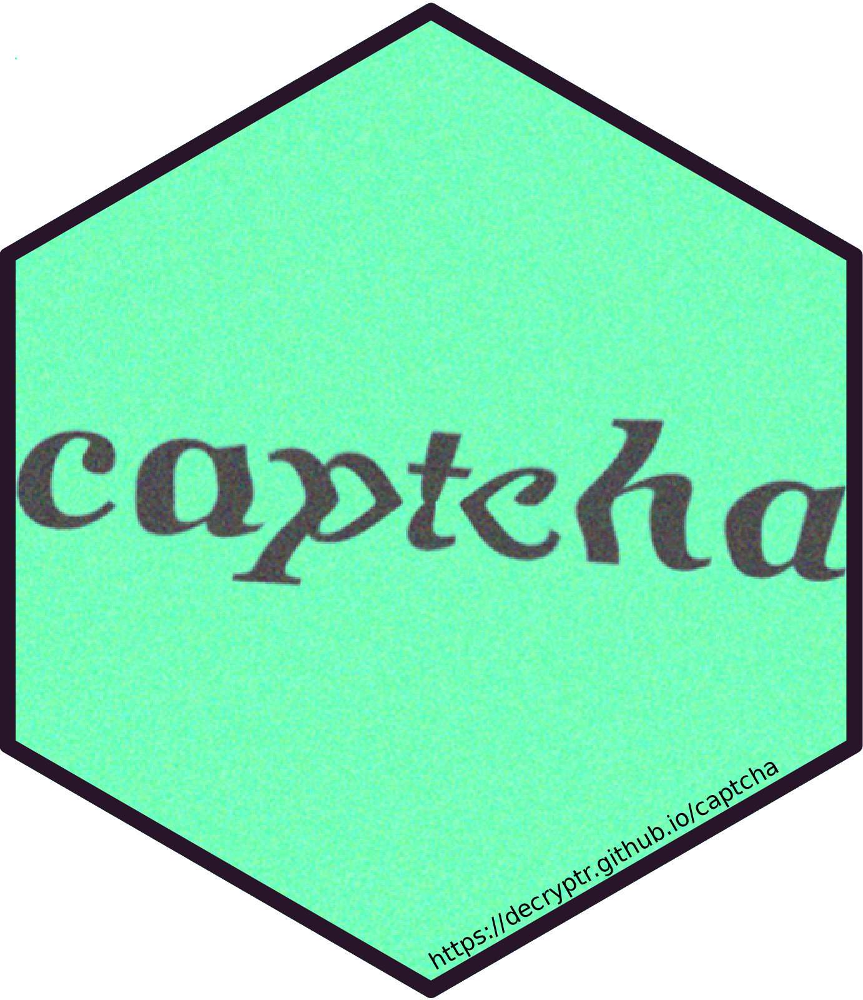

<!-- README.md is generated from README.Rmd. Please edit that file -->

# captcha 

<!-- badges: start -->

[](https://lifecycle.r-lib.org/articles/stages.html#experimental)
[](https://app.codecov.io/gh/decryptr/captcha?branch=master)
[](https://github.com/decryptr/captcha/actions/workflows/R-CMD-check.yaml)
[](https://CRAN.R-project.org/package=captcha)
<!-- badges: end -->

This package is an extensible API to build models and solve Captchas
(Completely Automated Public Turing test to tell Computers and Humans
Apart). It provides tools to read Captchas, visualize Captchas, annotate
Captchas, fit models, and share fitted models.

## Installation

One can install the development version of `{captcha}` package running

``` r
remotes::install_github("decryptr/captcha")
```

## Basic usage

The basic usage of `{captcha}` involves the functions `read_captcha()`,
`plot()`, `captcha_annotate()`, `captcha_load_model()` and `decrypt()`.
The diagram below summarizes the relationships between these functions.
The arrows indicate the dependency of functions on objects generated by
other functions.


### Read and visualize

The `read_captcha()` function reads a character vector of image files
and stores them in memory. Behind the scenes, the function uses the
[`{magick}`](https://docs.ropensci.org/magick/) package to deal with the
types of files that may appear (JPEG, PNG, among others).

``` r
library(captcha)
exemplo <- "man/figures/dados_tjmg.jpeg"
captcha <- read_captcha(exemplo)

captcha
#>   format width height colorspace matte filesize density
#> 1   JPEG   100     50       sRGB FALSE     4530   72x72
```


The function returns an object of class `captcha`, which can be used by
other methods.

``` r
class(captcha)
#> [1] "captcha"
```

The captcha object is a list with three elements: `$img`, which contains
the image read from the `{magick}` package; `$lab`, which contains the
image label (by default, `NULL`); and `$path`, which contains the path
of the image.

``` r
str(captcha)
#> Class 'captcha'  hidden list of 3
#>  $ img :Class 'magick-image' <externalptr> 
#>  $ lab : NULL
#>  $ path: chr "man/figures/dados_tjmg.jpeg"
```

The `read_captcha()` function has an `lab_in_path=` parameter, which
indicates whether the image path contains the label. If
`lab_in_path=TRUE`, the function will try to extract the label from the
file (getting the text that comes after the last `_` of the path) and
store it in the `$lab` element.

``` r
exemplo <- "man/figures/mnist128c49c36e13_6297.png"
captcha <- read_captcha(exemplo, lab_in_path = TRUE)

str(captcha)
#> Class 'captcha'  hidden list of 3
#>  $ img :Class 'magick-image' <externalptr> 
#>  $ lab : chr "6297"
#>  $ path: chr "man/figures/mnist128c49c36e13_6297.png"
```

The `plot()` function is a method of [class
S3](https://adv-r.hadley.nz/s3.html) from base R. The function
facilitates the visualization of Captchas. The function receives a list
of images (obtained with the `read_captcha()` function) and displays the
Captcha visually.

``` r
exemplo <- "man/figures/dados_tjmg.jpeg"
captcha <- read_captcha(exemplo)
plot(captcha)
```


An interesting aspect of the `plot()` function is that it deals with a
list of Captchas. It is useful when the goal is to view several Captchas
in the image simultaneously. The next image shows an example.

``` r
exemplos <- paste0("man/figures/", c(
  "dados_tjmg.jpeg",
  "dados_esaj.png",
  "dados_rfb.png",
  "dados_sei.png"
))
captchas <- read_captcha(exemplos)
plot(captchas)
```


By default, the `plot()` function arranges the images into four columns.
To change the default, one can modify the options using
`options(captcha.print.cols = N)`, where `N` is the desired number of
columns. The next image shows an example with two columns.

``` r
options(captcha.print.cols = 2)
plot(captchas)
```


When the list of Captchas is too long, the `plot()` function displays a
maximum number of images accompanied by a message. By default, this
number is 100, with 25 rows and four columns. One can override the
option by combining the `captcha.print.cols=` and `captcha.print.rows=`
options. The next image shows an example of the function’s behavior when
the number of images exceeds 100.

``` r
# more than 100 imagens:
examples <- rep("man/figures/dados_tjmg.jpeg", 110)
captchas <- read_captcha(examples)
plot(captchas)
#> ℹ Too many images, printing first 100. To override, run
#> • options('captcha.print.rows' = MAX_ROWS)
#> • options('captcha.print.cols' = COLUMNS)
```


It is possible to create subsets of `captcha` objects using the `[`
operator. One can also use the `length()` function to measure the number
of images. The next image shows an example of these operations.

``` r
captchas_subset <- captchas[1:20]
length(captchas_subset) # 20
#> [1] 20
plot(captchas_subset)
```


Finally, when the image has a label, the `plot()` function shows the
label on the corner of the image. The following image shows an example.

``` r
example <- "man/figures/mnist128c49c36e13_6297.png"
captcha <- read_captcha(example, lab_in_path = TRUE)
plot(captcha)
```


### Annotate

The `captcha_annotate()` function annotates a Captcha image, either
manually or automatically. It modifies the image path and adds the text
`_label` to the end of the file path. The function has the following
parameters:

- `files=`: object of class captcha read with function `read_captcha()`
  (recommended) or character vector of file paths.
- `labels=`: (optional) character vector with image labels. It must have
  the same `length()` as `files=`. The value is `NULL` by default,
  prompting the user to enter the label manually.
- `path=`: (optional) path of the folder to save the annotated files. By
  default, it saves files with modified names in the same folder as the
  original files.
- `rm_old=`: (optional) whether or not to delete the original files.
  Defaults to `FALSE`.

The `captcha_annotate()` function returns a vector with the paths of the
modified files. The `labels=` parameter can handle situations where one
knows the Captcha label. For example, a workflow that uses an oracle
might provide the label automatically.

When the label doesn’t exist, the `captcha_annotate()` function opens
the prompt for classification and shows the image using `plot()`. The
following image shows an application example of the `captcha_annotate()`
function in [RStudio](https://posit.co/download/rstudio-desktop/).


### Predict

The `decrypt()` function returns a label for an image using a fitted
model. The function takes two arguments: `file=`, which can be either
the file path or a captcha class object, and `model=`, which contains an
object of class luz_module_fitted, fitted using the
[{luz}](https://mlverse.github.io/luz/) package.

``` r
model <- captcha_load_model("cadesp")
img <- "man/figures/dados_cadesp.jpg"
captcha <- read_captcha(img)
plot(captcha)
```


``` r
decrypt(captcha, model)
#> [1] "dwyy"
```

There are fitted models for several different Captchas available in the
captcha package. It is possible to load a trained model using the
`captcha_load_model()` function. The `path=` parameter contains either
the path for a fitted model or a string with the name of a released
model, like `"rfb"`. Fitted models are stored in the `{captcha}` package
repository releases, which can be downloaded using the [`{piggyback}`
package](https://docs.ropensci.org/piggyback/) package.

Currently, the Captchas with available fitted models are `trf5`, `tjmg`,
`trt`, `esaj`, `jucesp`, `tjpe`, `tjrs`, `cadesp`, `sei` and `rfb`. The
table below describes the models and their accuracy.

| Name/Link                                                                                                                                                                                 | Example                                                                   | Description                                         | Accuracy |
|:------------------------------------------------------------------------------------------------------------------------------------------------------------------------------------------|:--------------------------------------------------------------------------|:----------------------------------------------------|---------:|
| [trf5](https://pje.trf5.jus.br/pje/ConsultaPublica/listView.seam)                                                                                                                         |    | Tribunal Regional Federal 5                         |   98.77% |
| [tjmg](https://www4.tjmg.jus.br/juridico/sf/proc_resultado.jsp?comrCodigo=24&numero=1&listaProcessos=50718889720218130024&btn_pesquisar=Pesquisar)                                        |   | Tribunal de Justiça de Minas Gerais                 |   98.35% |
| [trt](https://pje-consulta.trt3.jus.br/pje-consulta-api/api/processos/2104879)                                                                                                            |    | Tribunal Regional do Trabalho 3                     |   98.50% |
| [esaj](http://esaj.tjba.jus.br/cpopg/open.do)                                                                                                                                             |    | Tribunal de Justiça da Bahia                        |   94.50% |
| [jucesp](https://www.jucesponline.sp.gov.br/ResultadoBusca.aspx)                                                                                                                          |  | Junta Comercial de São Paulo                        |   89.88% |
| [tjpe](https://srv01.tjpe.jus.br/consultaprocessualunificada/)                                                                                                                            |    | Tribunal de Justiça de Pernambuco                   |   91.88% |
| [tjrs](https://www.tjrs.jus.br/site_php/consulta/verificador.php)                                                                                                                         |    | Tribunal de Justiça do Rio Grande do Sul            |   99.57% |
| [cadesp](https://www.cadesp.fazenda.sp.gov.br/(S(vyfz1cfybbxj3sgpf4eqhxd3))/Pages/Cadastro/Consultas/ConsultaPublica/ConsultaPublica.aspx)                                                |  | Centro de Apoio ao Desenvolvimento da Saúde Pública |   96.37% |
| [sei](https://sei.economia.gov.br/sei/modulos/pesquisa/md_pesq_processo_pesquisar.php?acao_externa=protocolo_pesquisar&acao_origem_externa=protocolo_pesquisar&id_orgao_acesso_externo=0) |     | Sistema Eletrônico de Informações - ME              |   77.25% |
| [rfb](https://servicos.receita.fazenda.gov.br/servicos/cnpjreva/Cnpjreva_Solicitacao_CS.asp)                                                                                              |     | Receita Federal                                     |   95.70% |

### Fit custom model

The `{captcha}` package provides a basic interface for fitting custom
models from a fully labeled data. Annotation can be done manually using
the `captcha_annotate()` function presented earlier or with another
method developed by the user. The model uses a convolutional neural
network architecture, similar to the [LeNet-5
model](https://en.wikipedia.org/wiki/LeNet).

The modeling step has some assumptions about the file names. Images must
be in a folder and have the pattern `path/to/file/<id>_<lab>.<ext>`,
where:

- `<id>`: can be any name, preferably without accents or other special
  characters, to avoid encoding issues. It usually contains a name for
  the type and a hash to identify the image uniquely. **Note**: When
  annotating a file, the id must be unique, as two Captchas can have the
  same label.
- `<lab>`: is the Captcha label. It is a string of characters between
  `[a-zA-Z0-9]`, which can be case-sensitive if necessary. All labels
  must have the same length.
- `<ext>`: file extension. It can be `.png`, `.jpeg` or `.jpg`. The
  operations also work for the `.svg` format, but it may have problems
  due to the image’s transparency.

The `captcha_fit_model()` function fits a model from a folder with
annotated images. The function considers the parameters:

- `dir=`: the path of the annotated files;
- `dir_valid=`: (optional) the path of annotated files for validation;
- `prop_valid`=:, the proportion of the training set to be considered as
  validation. `prop_valid=` is ignored when `dir_valid=` is given (by
  default, 20% of the dataset is considered as validation).

The `captcha_fit_model()` function also has some parameters related to
the neural network. They are:

- `dropout=`: the dropout percentage applied to the hidden layers of the
  network (by default, 0.25);
- `dense_units=`: the number of units in the hidden layer that comes
  after the convolutional layers (by default, 200);
- `decay=`: the learning rate decay percentage (by default, 0.99);
- `epochs=`: the number of epochs to fit the model (by default, 100).

An important note is that the model stops fitting after 20 iterations
without significant increment of accuracy (chosen as 1%; for more
details, see the [advanced guide](TODO)).

The function returns a fitted model of class `luz_module_fitted`, which
can be saved to disk using `luz_save()`. One can also serialize the
model to use it with other packages such as PyTorch. A tutorial on
serialization can be found in the [torch package
documentation](https://torch.mlverse.org/docs/articles/serialization.html).

Fitting a new Captcha model can be challenging. To help with that, the
`{captcha}` package documentation provides an [application example]().
The example uses Captchas from `captcha_generate()` function, which
generates Captchas using the `{magick}` package. The
`captcha_generate()` function has the following parameters:

- `write_disk=`: save files to disk? By default, `FALSE`.
- `path=`: Path to save files on disk, if the previous parameter is
  `TRUE`.
- `chars=`: Which characters to use in the image.
- `n_chars=`: The length of the Captcha.
- `n_rows=`: Height of the image, in pixels.
- `n_cols=`: Width of the image, in pixels.
- `p_rotate=`: Probability of image rotation.
- `p_line=`: Probability of adding a line between the letters.
- `p_stroke=`: Probability of adding a border to the letters.
- `p_box=`: Probability of adding a box (rectangle) around the letters.
- `p_implode=`: Probability of adding implode effects.
- `p_oilpaint=`: Probability to add oil paint effects.
- `p_noise=`: Probability of adding white noise to the background of the
  image.
- `p_lat=`: Probability of applying the *local adaptive thresholding*
  algorithm to the image.

## Advanced usage

Once the premises of the classified base are met, it is possible to fit
a neural network model using the `{captcha}` package. However, the
training step involves many small adaptations, it was decided to export
functions in two depth levels. To address that, the `{captcha}` package
also provides a **procedural** approach to fit the model, using a
step-by-step described in the [advanced guide](TODO).
