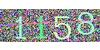

<!-- README.md is generated from README.Rmd. Please edit that file -->

# captcha

<!-- badges: start -->

[](https://lifecycle.r-lib.org/articles/stages.html#experimental)
<!-- badges: end -->

This package is an extensible API to build models and solve CAPTCHAs
(Completely Automated Public Turing test to tell Computers and Humans
Apart). It provides tools to read, visualize, classify, model and share
fitted models.

## Installation

You can install the development version of `{captcha}` package running

``` r
remotes::install_github("decryptr/captcha")
```

## Basic usage

The basic usage of `{captcha}` involves the functions `read_captcha()`,
`plot()`, `classify()`, `captcha_load_model()` and `decrypt()`. The
diagram below summarizes the relationships between these functions. The
arrows indicate the dependency of functions on objects generated by
other functions.


### Read and visualize

The `read_captcha()` function reads an array of image files and stores
them in memory. Behind the scenes, the function uses the `{magick}`
package to deal with the types of files that may appear (JPEG, PNG,
among others).

``` r
library(captcha)
exemplo <- "man/figures/dados_tjmg.jpeg"
captcha <- read_captcha(exemplo)

captcha
#>   format width height colorspace matte filesize density
#> 1   JPEG   100     50       sRGB FALSE     4530   72x72
```


The function returns an object with the `captcha` class, which can be
used by other methods.

``` r
class(captcha)
#> [1] "captcha"
```

The object is a list with three elements: `$img`, which contains the
image read from the `{magick}` package, `$lab`, which contains the image
label (by default, `NULL`), and `$path`, which contains the path of the
image that was read.

``` r
str(captcha)
#> Class 'captcha'  hidden list of 3
#>  $ img :Class 'magick-image' <externalptr> 
#>  $ lab : NULL
#>  $ path: chr "man/figures/dados_tjmg.jpeg"
```

The `read_captcha()` function has an `ans_in_path=` parameter, which
indicates whether the label is contained in the image path. If
`ans_in_path=TRUE`, the function will try to extract the label from the
file (getting the text that comes after the last `_` of the path) and
store it in the `$lab` element.

``` r
exemplo <- "man/figures/mnist128c49c36e13_6297.png"
captcha <- read_captcha(exemplo, ans_in_path = TRUE)

str(captcha)
#> Class 'captcha'  hidden list of 3
#>  $ img :Class 'magick-image' <externalptr> 
#>  $ lab : chr "6297"
#>  $ path: chr "man/figures/mnist128c49c36e13_6297.png"
```

The plot function `plot()` is a method of [class
S3](https://adv-r.hadley.nz/s3.html) from basic R. The function was
implemented to facilitate the visualization of Captchas. The function
receives a list of images obtained by the `read_captcha()` function and
displays the Captcha visually, as in the image below.

``` r
exemplo <- "man/figures/dados_tjmg.jpeg"
captcha <- read_captcha(exemplo)
plot(captcha)
```


An interesting aspect of the `plot()` function is that it deals with a
list of Captchas. This is useful when you are interested in viewing
several Captchas in the image at once. The next image shows an example.

``` r
exemplos <- paste0("man/figures/", c(
  "dados_tjmg.jpeg",
  "dados_esaj.png",
  "dados_rfb.png",
  "dados_sei.png"
))
captchas <- read_captcha(exemplos)
plot(captchas)
```


By default, the plot function arranges the images in four columns. To
change the default, you can modify the options using
`options(captcha.print.cols = N)`, where `N` is the desired number of
columns. The next image shows an example with two columns.

``` r
options(captcha.print.cols = 2)
plot(captchas)
```


When the array of Captchas is too large, the `plot()` function displays
a maximum number of images, accompanied by a message. By default, this
number is 100, with 25 rows and 4 columns. The option can be overridden
by combining the `captcha.print.cols=` and `captcha.print.rows=`
options. The next image shows an example of the function’s behavior when
the number of images exceeds 100.

``` r
# more than 100 imagens:
examples <- rep("man/figures/dados_tjmg.jpeg", 110)
captchas <- read_captcha(examples)
plot(captchas)
#> ℹ Too many images, printing first 100. To override, run
#> • options('captcha.print.rows' = MAX_ROWS)
#> • options('captcha.print.cols' = COLUMNS)
```


An interesting detail is that it is possible to create subsets of a
`captcha` class object simply using the `[` operator. The `length()`
function can also be used to measure the amount of images read. The next
image shows an example of these operations.

``` r
captchas_subset <- captchas[1:20]
length(captchas_subset) # 20
#> [1] 20
plot(captchas_subset)
```


Finally, if the image has a label, by default the `plot()` function
shows the label in the corner of the image. The next image shows an
example.

``` r
example <- "man/figures/mnist128c49c36e13_6297.png"
captcha <- read_captcha(example, ans_in_path = TRUE)
plot(captcha)
```


### Classify

The `classify()` function serves to classify a Captcha image, either
manually or automatically. This is done by modifying the image path,
adding the text `_label` to the end of the file path. The function has
the parameters listed below:

- `files=`: object of class `captcha` read with function
  `read_captcha()` (recommended) or array of file paths.
- `answers=`: (optional) vector with image labels. Must be the same
  `length()` as `files=`. By default, the value is `NULL`, indicating
  that a `prompt` should be opened for the user to enter the answer
  manually.
- `path=`: (optional) path of the folder where classified files will be
  saved. By default, it saves files with modified names in the same
  folder as the original files.
- `rm_old=`: (optional) whether or not to delete the original files. By
  default it is `FALSE`.

The function returns a vector with the paths of the modified files. The
`answer` parameter is useful for handling situations where we know the
Captcha label. For example, in a workflow that uses oracle, it might be
that an initial template already provides the correct label value.

When the initial model fails or when no initial model exists, it is the
user’s role to enter the label manually. This is facilitated with the
`classify()` function, which opens the `prompt` for classification and
applies `plot()` to visualize the image. The next image shows an
application example of the `classify()` function in the software
[RStudio](https://posit.co/download/rstudio-desktop/).


### Predict

The function `decrypt()` has the role of obtaining the label of an image
using a model already trained for that type of image. The function takes
two arguments: `file=` which can be either the file path or a `captcha`
class object, and a `model=` argument, which contains a
`luz_module_fitted` class model, fitted using the tools that will be
presented in the next subsection.

``` r
model <- captcha_load_model("cadesp")
img <- "man/figures/dados_cadesp.jpg"
captcha <- read_captcha(img)
plot(captcha)
```


``` r
decrypt(captcha, model)
#> [1] "dwyy"
```

Models were developed for several different Captchas. It is possible to
load an already trained model using the `captcha_load_model()` function,
being able to receive in its only parameter `path=` the path of a file
containing an adjusted model or a *string* with the name of an already
trained model, like `"rfb"`, for example. Trained models are stored in
the [captcha package repository
releases](https://github.com/decryptr/captcha/releases), are downloaded
and controlled by the [`{piggyback}`
package](https://docs.ropensci.org/piggyback/), and are read using the
[`{luz}` package](https://mlverse.github.io/luz/), which will be
described in more detail in the next subsection.

For now, the Captchas with developed models were `trf5`, `tjmg`, `trt`,
`esaj`, `jucesp`, `tjpe`, `tjrs`, `cadesp`, `sei` and `rfb`. The table
below shows all the available models and their accuracy.

| Name/Link                                                                                                                                                                                 | Example                                                                   | Description                                         | Accuracy |
|:------------------------------------------------------------------------------------------------------------------------------------------------------------------------------------------|:--------------------------------------------------------------------------|:----------------------------------------------------|---------:|
| [trf5](https://pje.trf5.jus.br/pje/ConsultaPublica/listView.seam)                                                                                                                         |    | Tribunal Regional Federal 5                         |  100.00% |
| [tjmg](https://www4.tjmg.jus.br/juridico/sf/proc_resultado.jsp?comrCodigo=24&numero=1&listaProcessos=50718889720218130024&btn_pesquisar=Pesquisar)                                        |   | Tribunal de Justiça de Minas Gerais                 |   98.35% |
| [trt](https://pje-consulta.trt3.jus.br/pje-consulta-api/api/processos/2104879)                                                                                                            |    | Tribunal Regional do Trabalho 3                     |   99.67% |
| [esaj](http://esaj.tjba.jus.br/cpopg/open.do)                                                                                                                                             |    | Tribunal de Justiça da Bahia                        |   94.50% |
| [jucesp](https://www.jucesponline.sp.gov.br/ResultadoBusca.aspx)                                                                                                                          |  | Junta Comercial de São Paulo                        |   90.50% |
| [tjpe](https://srv01.tjpe.jus.br/consultaprocessualunificada/)                                                                                                                            |    | Tribunal de Justiça de Pernambuco                   |   91.75% |
| [tjrs](https://www.tjrs.jus.br/site_php/consulta/verificador.php)                                                                                                                         |    | Tribunal de Justiça do Rio Grande do Sul            |  100.00% |
| [cadesp](https://www.cadesp.fazenda.sp.gov.br/(S(vyfz1cfybbxj3sgpf4eqhxd3))/Pages/Cadastro/Consultas/ConsultaPublica/ConsultaPublica.aspx)                                                |  | Centro de Apoio ao Desenvolvimento da Saúde Pública |   96.37% |
| [sei](https://sei.economia.gov.br/sei/modulos/pesquisa/md_pesq_processo_pesquisar.php?acao_externa=protocolo_pesquisar&acao_origem_externa=protocolo_pesquisar&id_orgao_acesso_externo=0) |     | Sistema Eletrônico de Informações - ME              |   76.85% |
| [rfb](https://servicos.receita.fazenda.gov.br/servicos/cnpjreva/Cnpjreva_Solicitacao_CS.asp)                                                                                              |     | Receita Federal                                     |   97.16% |

### Fit custom model

The `{captcha}` package provides a basic interface for developing models
from a fully labeled data. Classification can be done manually by the
`classify()` function, presented earlier, or by another method developed
by the user.

The modeling part starts from some assumptions about the database.
Images must be in a folder and have the pattern
`path/to/file/<id>_<lab>.<ext>`, where:

- `<id>`: can be any name, preferably without accents or other special
  characters, to avoid *encoding* problems. This is usually a *hash*
  identifying the type and id of the captcha. **Note**: When classifying
  a case it is important that the `id` is unique as two Captchas can
  have the same label.
- `<lab>`: is the Captcha label. Can be a string of characters between
  `[a-zA-Z0-9]`, case sensitive if necessary. Currently, all files in a
  folder must be the same number of characters (homogeneous length). In
  the future, the package may consider Captchas of heterogeneous length.
- `<ext>`: file extension. It can be `.png`, `.jpeg` or `.jpg`. The
  operations also work for the `.svg` format, but it may have problems
  due to the transparency of the image.

The `captcha_fit_model()` function fits a model from a folder with
classified files. The function receives the parameters: `dir=`,
containing the path of the classified files; `dir_valid=`, (optional)
containing the path of classified files for validation; `prop_valid=`,
containing the proportion of the training base to be considered as
validation, ignored when `dir_valid=` is given (by default, 20% of the
base is considered as validation)

The `captcha_fit_model()` function also has some parameters related to
modeling. They are: `dropout=`, specifying the *dropout* percentage
applied to the hidden layers of the network (by default, `0.25`);
`dense_units=`, specifying the amount of units in the hidden layer that
comes after the convolutional layers (by default, 200); `decay=`,
specifying the learning rate decay percentage (by default, `0.99`);
`epochs=` number of epochs to fit the model (by default 100). An
important observation is that the model is configured to stop fitting
after 20 iterations without significant reduction in the loss function
(arbited at 1%; for more details see the [advanced guide](TODO)).

At the end, the function returns a fitted model with the
`luz_module_fitted` class, which can be saved to disk using the
`luz_save()` function. The model can also be serialized for use in other
packages such as pytorch. A tutorial on serialization can be found in
the [torch package
documentation](https://torch.mlverse.org/docs/articles/serialization.html).

In the `{captcha}` package documentation, an application example has
been added. The example uses captchas generated using the
`captcha_generate()` function, which generates Captchas using the
`{magick}` package. The Captcha was created for the construction of the
thesis, nicknamed `R-Captcha`, and has the following parameters:

- `write_disk=`: save files to disk? By default it is false.
- `path=`: Path to save files on disk, if the previous parameter is
  true.
- `chars=`: Which characters to use in the image.
- `n_chars=`: The length of the Captcha.
- `n_rows=`: Height of the image, in pixels.
- `n_cols=`: Width of the image, in pixels.
- `p_rotate=`: Probability of image rotation.
- `p_line=`: Probability of adding a line between the letters.
- `p_stroke=`: Probability of adding a border to the letters.
- `p_box=`: Probability of adding a box (rectangle) around the letters.
- `p_implode=`: Probability of adding implode effects.
- `p_oilpaint=`: Probability to add oil paint effects.
- `p_noise=`: Probability of adding white noise to the background of the
  image.
- `p_lat=`: Probability of applying the *local adaptive thresholding*
  algorithm to the image.

## Advanced usage

Once the premises of the classified base are met, it is possible to
adjust a neural network model using the `{captcha}` package. However, as
the adjustment of neural network models involves a series of nuances and
small adaptations, it was decided to export functions in two depth
levels. The first is the **automated**, using the `captcha_fit_model()`
function described below, while the second is the **procedural**, using
the step-by-step procedure described in the [advanced guide](TODO).
