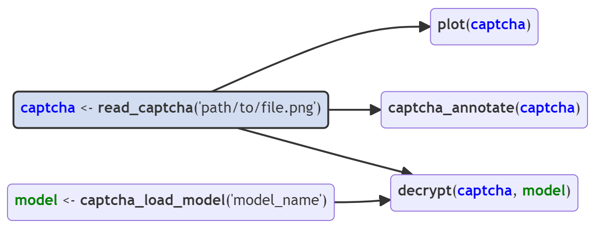
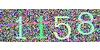
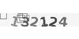
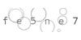

# Summary

The `{captcha}` package is a toolbox for researches who need to solve text-on-image Captchas (Completely Automated Public Turing test to tell Computers and Humans Apart) for their academic work. The package includes fundamental operations for reading, visualizing, and annotating Captchas. Additionally, it offers modeling capabilities using the torch backend [@torch] to fit new models, load pre-trained models, share fitted models, and solve Captchas. Finally, the package provides a streamlined workflow for solving new Captchas by enabling the creation of a new repository with a step-by-step guide.

# Statement of need

Captcha (Completely Automated Public Turing test to tell Computers and Humans Apart) is a challenge aimed to identify whether access to a webpage is performed by a human or a robot [@vonahnTellingHumansComputers2004]. The challenge is designed to be easy for humans to solve, but difficult for machines.

In principle, the use of Captchas increases the security of individuals accessing the internet and protect web systems from abusive use. For human website users, Captchas represent a minor inconvenience, whereas for those performing massive accesses, they pose a significant difficulty.

However, the presence of Captchas on websites is detrimental to society when automated access is necessary to conduct scientific research on publicly available, but not openly accessible data [@molloy2011open]. Several sites storing public data use Captchas and do not provide data in an open format, increasing significantly the effort needed to produce scientific research.

This package is relevant to science for two reasons: technical feasibility and practical importance. With regard to technical feasibility, the package provides the necessary tools to develop solutions for new Captchas, including tasks of reading, annotating and fitting models using Torch framework. With regard to practical importance, the package provides a list of Captchas that have already been solved using deep learning techniques [@lecunDeepLearning2015]. The [package release page](https://github.com/decryptr/captcha/releases) provides open access to datasets and fitted models for various Captchas.

# Basic usage

The basic usage of `{captcha}` involves the functions `read_captcha()`, `plot()`, `captcha_annotate()`, `captcha_load_model()` and `decrypt()`. The diagram below summarizes the relationships between these functions. The arrows indicate the dependency of functions on objects generated by other functions.

```{r}
#| label: fig-captcha-diagram-simple
#| fig-align: center
#| echo: false
#| out-width: 90%

```

The `read_captcha()` function reads a character vector of image files and stores them in memory. Behind the scenes, the function uses the [`{magick}`](https://docs.ropensci.org/magick/) [@magick] package to deal with the types of files that may appear (JPEG, PNG, among others).

```{r}
#| label: fig-example-plot-inicial
#| echo: true
#| out-width: 0%
library(captcha)
example <- "dados_tjmg.jpeg"
captcha <- read_captcha(example)
captcha
```

The function returns an object of class `captcha`, which can be used by other methods. Internally, is a list with three elements: `$img`, which contains the image read from the `{magick}` package; `$lab`, which contains the image label (by default, `NULL`); and `$path`, which contains the path of the image.

The `plot()` function is a method of [class S3](https://adv-r.hadley.nz/s3.html) from base R. The function facilitates the visualization of Captchas. The function receives a list of images (obtained with the `read_captcha()` function) and displays the Captcha visually.

```{r}
#| label: fig-example-plot
#| echo: true
#| out-width: 30%
example <- "dados_tjmg.jpeg"
captcha <- read_captcha(example)
plot(captcha)
```

The `captcha_annotate()` function annotates a Captcha image, either manually or automatically. It modifies the image path and adds the text `_label` to the end of the file path.  The function returns a vector with the paths of the modified files. The `labels=` parameter can handle situations where one knows the Captcha label. For example, a workflow that uses an oracle might provide the label automatically. When the label doesn't exist, the `captcha_annotate()` function opens the prompt for classification and shows the image using `plot()`. 

The `decrypt()` function returns a label for an image using a fitted model. The function takes two arguments: `file=`, which can be either the file path or a captcha class object, and `model=`, which contains an object of class luz_module_fitted, fitted using the [{luz}](https://mlverse.github.io/luz/) package.

```{r}
#| label: fig-example-decrypt
#| out-width: 30%
#| message: false
model <- captcha_load_model("cadesp")
img <- "dados_cadesp.jpg"
captcha <- read_captcha(img)
plot(captcha)
decrypt(captcha, model)
```

There are several fitted models for several different Captchas accessible through the `{captcha}` package. It is possible to load a trained model using the `captcha_load_model()` function.  The `path=` parameter contains either the path for a fitted model or a string with the name of a released model, like `"rfb"`. Fitted models are stored in the `{captcha}` package repository releases, which can be downloaded using the [`{piggyback}` package](https://docs.ropensci.org/piggyback/) [@Boettiger2018]. Currently, the Captchas with available fitted models are `trf5`, `tjmg`, `trt`, `esaj`, `jucesp`, `tjpe`, `tjrs`, `cadesp`, `sei` and ` rfb`. The table below describes the models and their accuracy.

```{r}
#| label: tbl-available-models
#| message: false
#| echo: false
tibble::tribble(
     ~name,                                  ~img,                                                 ~desc,     ~acc,
  "cadesp", "{width=70px}", "Centro de Apoio ao Desenvolvimento da Saude Publica", "96.37%",
    "esaj",     "{width=70px}",                        "Tribunal de Justica da Bahia", "94.50%",
  "jucesp", "{width=70px}",                        "Junta Comercial de Sao Paulo", "89.88%",
     "rfb",       "{width=70px}",                                     "Receita Federal", "95.70%",
     "sei",       "{width=70px}",              "Sistema Eletronico de Informacoes - ME", "77.25%",
    "tjmg",    "{width=70px}",                 "Tribunal de Justica de Minas Gerais", "98.35%",
    "tjpe",     "{width=70px}",                   "Tribunal de Justica de Pernambuco", "91.88%",
    "tjrs",     "{width=70px}",            "Tribunal de Justica do Rio Grande do Sul", "99.57%",
    "trf5",     "{width=70px}",                         "Tribunal Regional Federal 5", "98.77%",
     "trt",      "{width=70px}",                     "Tribunal Regional do Trabalho 3", "98.50%"
  ) |> 
  knitr::kable(
    col.names = c("Name", "Example", "Description", "Accuracy") 
  )
```

# Custom model

The `{captcha}` package provides a basic interface for fitting custom models from a fully labeled data. Annotation can be done manually using the `captcha_annotate()` function presented earlier or with another method developed by the user. The model uses a convolutional neural network architecture, similar to the LeNet-5 model [@lecun1995comparison].

The `captcha_fit_model()` function fits a model from a folder with annotated images. It also has some parameters related to the neural network. The function returns a fitted model of class `luz_module_fitted` [@luz], which can be saved to disk using `luz_save()`.

The training step of neural networks involves many small adaptations, it was decided to export functions in two depth levels. To address that, the `{captcha}` package also provides a **procedural** approach to fit the model, using a step-by-step described in the [advanced guide](https://decryptr.github.io/captcha/articles/advanced.html).

# Acknowledgements

We acknowledge contributions from Daniel Falbel, Caio Lente, and Beatriz Milz, and support from Athos Damiani and Fernando Corrêa during the genesis of this project.

# References
