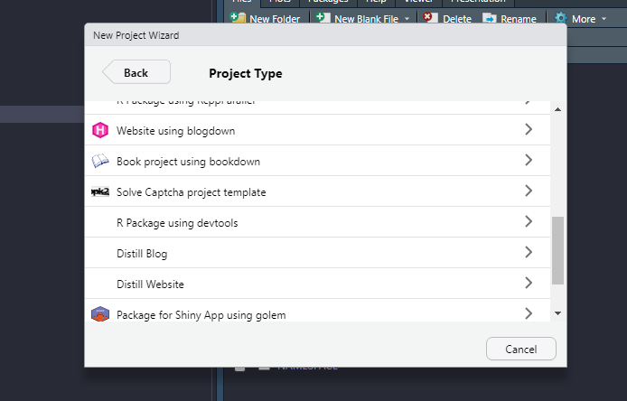

```{r, include = FALSE}
knitr::opts_chunk$set(
  collapse = TRUE,
  comment = "#>"
)
```

```{r setup}
library(captcha)
```

Deep learning models often need several small adjustments, such as the learning rate, use of other optimization functions, computational layers and preprocessing functions. Because of that, in some situations, it may be desirable to run custom models.

The `captcha_fit_model()` function is a good way to start, but it is too rigid. It accepts some parameters to structure the model, but it does not support customization. Packages like `{torch}` and `{luz}` exist to help with this issue, creating more flexible computing environments to operate deep learning models.

Another disadvantage of using `captcha_fit_model()` is the availability of the fitted models. A model can be used locally, but sharing the data and the model to other people does not have a well-defined procedure.

To organize the workflow, there is a workflow template implemented inside the `{captcha}` package. The function that orchestrates this workflow is `new_captcha()`. The function has only one parameter, `path=`, which is the path of the new project.

It is also possible to call the function by creating a project within RStudio. The following image shows an example of the template inside RStudio, after clicking on `New Project > New Directory`.

```{r}
#| label: fig-exemplo-rstudio-template
#| fig-cap: Creating a new Captcha project using RStudio.
#| echo: false
#| out-width: 70%
#| fig-align: center

```

After creating a new project, via the `new_captcha()` command or via the RStudio interface, a new window opens. The project contains four files:

- `01_download.R`: Contains some code to help writing functions that download Captchas in a real scenario. In practice, the download functions need to be adapted because the websites are organized in very different ways.
- `02_annotate.R`: Contains a *template* for manual annotation of Captchas. Manual annotation can either be performed using the interface created by the `{captcha}` package or externally. The annotated files are stored in the `img` folder.
- `03_model.R`: Contains a *template* for modeling, allowing complete customization of the fitting procedure. The *script* contains commands to load the data, specify the model, fit the model and save the fitted model.
- `04_share.R`: Contains operations to create a *git* repository of the solution and make the fitted model available. The model can be loaded afterwards using the `captcha_load_model()` function, without the need to copy files locally.

### `03_model.R` details

The first step of the *script* creates objects of type *dataset* (object that stores the data consistently) and *dataloader* (object that obtains samples from the dataset, which are used as *minibatches* inside the model), using a framework orchestrated by the `{torch}` package.

The `captcha_dataset()` function creates the *dataset*, taking a folder as a parameter and generates an object with classes `my_captcha`, `dataset` and `R6`. The function is actually a `dataset_generator` object, created using the `dataset()` function from the `{torch}` package. The object is called in the same way as a usual R function, accepting some additional parameters:

- `transform_image=`: transformation function to be applied to the image. By default, it uses the `captcha_transform_image()` function, which reads the image and resizes it to `32x192` dimensions. The dimension was chosen to facilitate the implementation of convolutional layers and to deal with the fact that usually Captchas are rectangular images.
- `transform_label=`: transformation function to generate the response variable. By default, it uses the `captcha_transform_label()` function, which receives a vector of all possible Captcha elements and applies the `one_hot()` operation, obtaining the matrix version of the response with zeros and ones.
- `augmentation=`: operations for data augmentation. For example, it could be a function that adds random noise to the original image so that when one resample it, the obtained data is always different.

The `captcha_dataset()` function must be used twice, once to create the training dataset and once to create the validation dataset. The separation of training and validation datasets must be done manually, copying part of the classified Captchas to a new folder, using randomization.

Next, the *dataloaders* are created using the `dataloader()` function from the `{torch}` package. In this part, the size of the *minibatch* is defined, in addition to other possible parameters. For more details, [access the function documentation at this link](https://torch.mlverse.org/docs/reference/dataloader.html). The *dataloaders* must be created for both training and validation datasets.

The next step involves the model specification. In the modeling *script*, the model is provided by the `net_captcha` object of the `{captcha}` package. As in the case of *dataset*, `net_captcha` is a special object of `{torch}`, with classes `CAPTCHA-CNN`, `nn_module` and `nn_module_generator`. The object can be used as a function, generating a `torch` module, similar to a prediction function. However, due to the way the object is used in later steps by the `{luz}` package, the object to be considered is the `nn_module_generator`, as stated in the *script*.

To customize the model, the user must create a new module, modifying the `initialize()` and `forward()` methods, which can be accessed inside the `net_captcha$public_methods` object. The first is responsible for initializing the model, containing the description of the operations that are performed, such as convolutions. The second is the *feed forward* function of neural networks, which receives an image and returns an object containing the *logits* or probabilities, in the format of the response variable.

By default, the template code is as described below. The parameters `input_dim=`, `output_ndigits=`, `output_vocab_size=` and `vocab=` describe, respectively, the dimensions of the image, the length of the response, the length of the alphabet and the elements of the alphabet. The `transform=`, `dropout=` and `dense_units=` parameters control, respectively, the image transformation function, the *dropout* hyperparameters and the number of units in the dense layer. Notice that the parameters of the convolutions are fixed, already prepared to work well with an image of dimensions `32x192`.


```{{r}}
initialize = function(input_dim,
                      output_ndigits,
                      output_vocab_size,
                      vocab,
                      transform,
                      dropout = c(.25, .25),
                      dense_units = 400) {
  
  # in_channels, out_channels, kernel_size, stride = 1, padding = 0
  self$batchnorm0 <- torch::nn_batch_norm2d(3)
  self$conv1 <- torch::nn_conv2d(3, 32, 3)
  self$batchnorm1 <- torch::nn_batch_norm2d(32)
  self$conv2 <- torch::nn_conv2d(32, 64, 3)
  self$batchnorm2 <- torch::nn_batch_norm2d(64)
  self$conv3 <- torch::nn_conv2d(64, 64, 3)
  self$batchnorm3 <- torch::nn_batch_norm2d(64)
  self$dropout1 <- torch::nn_dropout2d(dropout[1])
  self$dropout2 <- torch::nn_dropout2d(dropout[2])
  
  self$fc1 <- torch::nn_linear(
    # must be the same as last convnet
    in_features = prod(calc_dim_conv(input_dim)) * 64,
    out_features = dense_units
  )
  self$batchnorm_dense <- torch::nn_batch_norm1d(dense_units)
  self$fc2 <- torch::nn_linear(
    in_features = dense_units,
    out_features = output_vocab_size * output_ndigits
  )
  self$output_vocab_size <- output_vocab_size
  self$input_dim <- input_dim
  self$output_ndigits <- output_ndigits
  self$vocab <- vocab
  self$transform <- transform
}
```


The *feed forward* function is described below. The function applies the step-by-step procedure of a convolutional neural network, with an image `x` as input and returning a logit matrix giving the model weights for each letter of the answer. The model returns the logits, not the probabilities, because the loss function takes the logits as input. If the user decides to modify the `forward` method to return probabilities, she will also need to adapt the used loss function.

```{{r}}
forward = function(x) {

  out <- x |>
    # normalize
    self$batchnorm0() |>
    # layer 1
    self$conv1() |>
    torch::nnf_relu() |>
    torch::nnf_max_pool2d(2) |>
    self$batchnorm1() |>
    
    # layer 2
    self$conv2() |>
    torch::nnf_relu() |>
    torch::nnf_max_pool2d(2) |>
    self$batchnorm2() |>
    
    # layer 3
    self$conv3() |>
    torch::nnf_relu() |>
    torch::nnf_max_pool2d(2) |>
    self$batchnorm3() |>
    
    # dense
    torch::torch_flatten(start_dim = 2) |>
    self$dropout1() |>
    self$fc1() |>
    torch::nnf_relu() |>
    self$batchnorm_dense() |>
    self$dropout2() |>
    self$fc2()
  
  out$view(c(
    dim(out)[1],
    self$output_ndigits,
    self$output_vocab_size
  ))
  
}

```


Once the architecture of the model is defined, the penultimate step is the fitting step. It is orchestrated by the `{luz}` package, which facilitates the creation of the optimization *loop*. The `{luz}` package plays a role similar to what `keras` does for `tensorflow`.

In the case of Captchas, the `{luz}` code to fit the model is organized in four steps, linked by the *pipe* operator, or `|>`:

- `setup()`: determines the loss function, the optimizer and the metrics to be monitored. The loss function used in the script is `nn_multilabel_soft_margin_loss()` from `{torch}`, the optimizer is `optim_adam()` from `{torch}` and the metric is `captcha_accuracy()`, developed in the `{captcha}` package to show the accuracy considering the complete Captcha image and not the accuracy of each letter of the image, which would be the result if the `luz_metric_accuracy()` function from the `{luz}` package.
- `set_hparams()`: informs the hyperparameters and other model information. The parameters of this function are the same as the `initialize()` method of the neural network created in the previous step.
- `set_opt_hparams()`: informs the optimization hyperparameters. Parameters placed in this function are passed to the optimization function. In the script, the only used parameter is the learning rate, fixed at `0.01`.
- `fit()`: initializes the optimization *loop*. Here, it is necessary to set the training and validation *dataloaders*, the number of epochs (by default, 100), and the *callbacks*, which are operations to be applied at different moments of the fitting (for example, at the end of each iteration). By default, the *callbacks* are:
    - The learning rate decay parameter using a multiplicative rate. After each iteration, the learning rate decays by a factor determined by the function defined in `lr_lambda`, which by default is `0.99`. That is, in each epoch, the learning rate is 1% lower.
    - The early stopping. By default, it is set to stop if after 20 epochs the model does not improve accuracy by 1% in the validation dataset. 
    - The `log` file. By default, the model saves the fitting history in a *comma separated values* (CSV) file, containing the loss and accuracy of the model in the training and validation datasets, at the end of each epoch. The `log` file is important to monitor the model fitting and check its performance over the epochs.

The workflow defined by the `{luz}` package returns a fitted model object. The model has the `luz_module_fitted` class and can be inspected by running the object in the R console. A example is shown below. The object contains a concise and informative report, showing the total time, metrics obtained in training and validation, and the architecture of the fitted model.


    A `luz_module_fitted`
    ── Time ────────────────────────────────────────────────
    • Total time: 10m 48.1s
    • Avg time per training batch: 415ms
    • Avg time per validation batch 217ms

    ── Results ─────────────────────────────────────────────
    Metrics observed in the last epoch.

    ℹ Training:
    loss: 0.0049
    captcha acc: 0.996
    ℹ Validation:
    loss: 0.0356
    captcha acc: 0.905

    ── Model ───────────────────────────────────────────────
    An `nn_module` containing 628,486 parameters.

    ── Modules ─────────────────────────────────────────────
    • batchnorm0: <nn_batch_norm2d> #6 parameters
    • conv1: <nn_conv2d> #896 parameters
    • batchnorm1: <nn_batch_norm2d> #64 parameters
    • conv2: <nn_conv2d> #18,496 parameters
    • batchnorm2: <nn_batch_norm2d> #128 parameters
    • conv3: <nn_conv2d> #36,928 parameters
    • batchnorm3: <nn_batch_norm2d> #128 parameters
    • dropout1: <nn_dropout> #0 parameters
    • dropout2: <nn_dropout> #0 parameters
    • fc1: <nn_linear> #563,400 parameters
    • batchnorm_dense: <nn_batch_norm1d> #400 parameters
    • fc2: <nn_linear> #8,040 parameters


Lastly, the model must be saved to a local file. This is accomplished using the `luz_save()` function of the `{luz}` package, saving an object with the `.pt` extension, which will be used in `04_share.R`.

### `04_share.R` details

The script uses the `{usethis}` package to organize the repository, configuring Git (code versioning software) and GitHub (*web* repository organization system). Furthermore, the *script* uses the `{piggyback}` package to make the fitted model available in the *releases* of the new repository. Optionally, the user can also make the raw data with the annotated files available in a `.zip` file, which is recommended, as it allows other people to work with the same data and improve the models.

An important detail is about the usage of heavy files in the git repository. The *script* uses *releases* to share the solutions because it is not good practice to upload files such as fitted models or raw files (images) directly to the repository. This happens because the repository can become too heavy for the git algorithm to handle.

Once shared across releases in the repository, the model is readable by anyone using the `{captcha}` package. Just run the code below and the model will be loaded.

```{r}
#| eval: false
#| echo: true
model <- captcha_load_model("<name>", "<user>/<repo>")
```

With this, all the work can be shared and Captchas can be solved in a collaborative manner by the community. Using the `new_captcha()` workflow, the user has the flexibility to build custom models and the ease to share the results.
